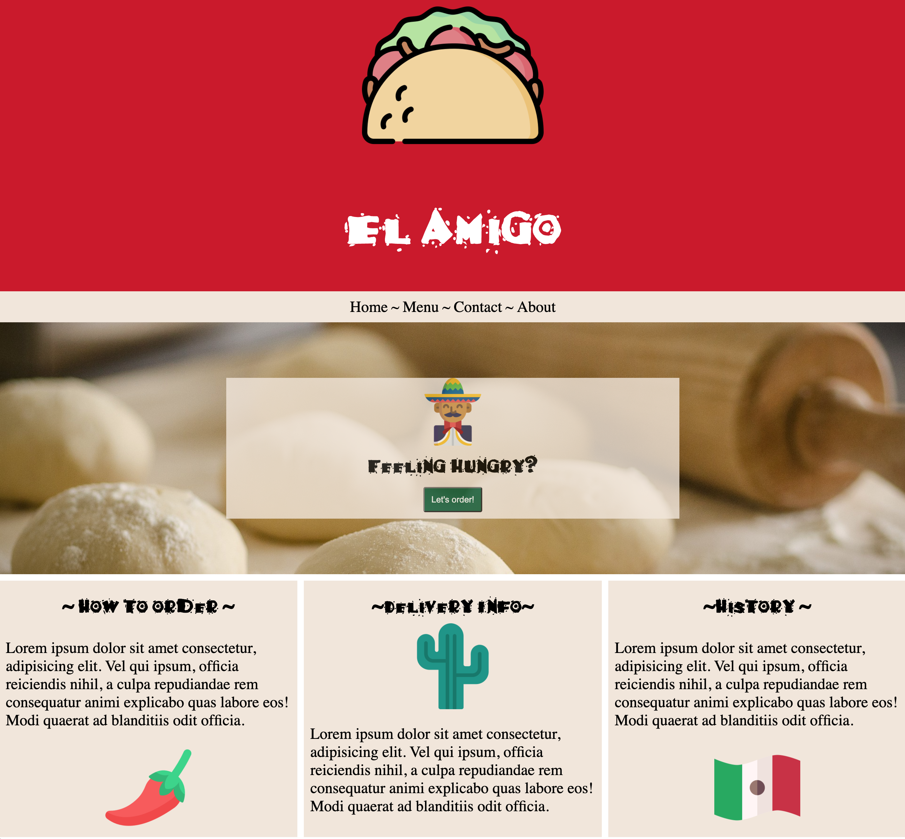

# Created a Mexican Resturant Full Stack Web application using Vue.js, Vuex, Vuex Router and Firebase(Firestore database, Cloud Functions), implemented Firebase authentication for admin user. Check out the live appliction here: https://elamigorest.netlify.app/


## Project setup

```
npm install
```

### Compiles and hot-reloads for development

```
npm run serve
```

### Compiles and minifies for production

```
npm run build
```

### Lints and fixes files

```
npm run lint
```

### Customize configuration

See [Configuration Reference](https://cli.vuejs.org/config/).
